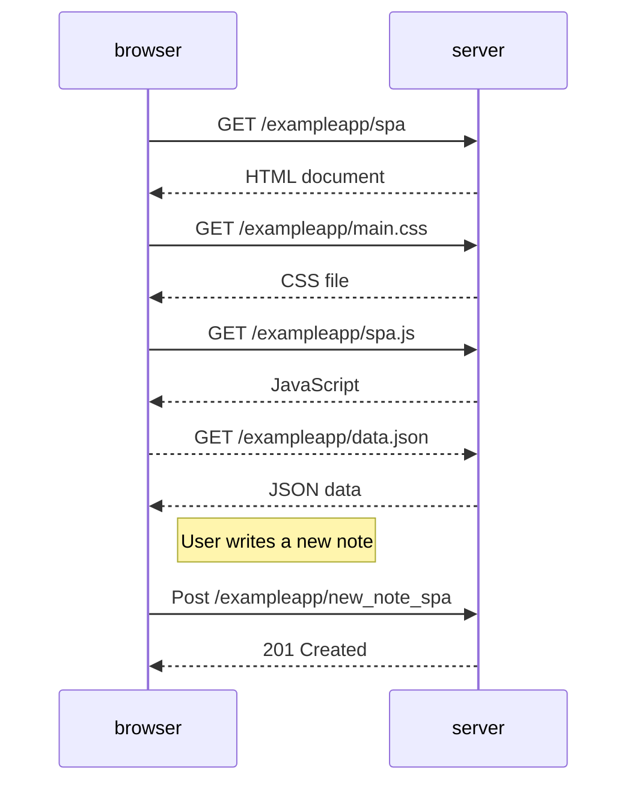

# 0.6NewNoteInSinglePageApp
Author: Claudio Ivan Sanchez 

```mermaid
sequenceDiagram
  participant browser
  participant server

  browser->>server: GET /exampleapp/spa
  server-->>browser: HTML document

  browser->>server: GET /exampleapp/main.css
  server-->>browser: CSS file

  browser->>server: GET /exampleapp/spa.js
  server-->>browser: JavaScript

  browser-->>server: GET /exampleapp/data.json
  server-->>browser: JSON data

  Note right of browser: User writes a new note

  browser->>server: Post /exampleapp/new_note_spa
  server-->>browser: 201 Created
```
